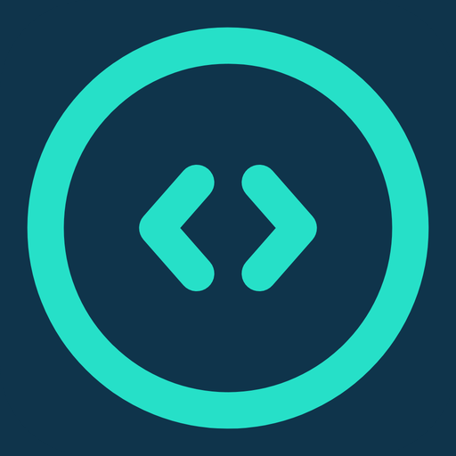

<p align="center">
  
</p>

<h1 align="center">FreeCoder</h1>

<p align="center">
  <strong>可完全免费、可完全离线的桌面 AI 编程助手</strong><br />
  后端来自 xAI Grok Build · 面向中国用户做了完整国产化适配
</p>

<p align="center">
  <b>中文</b> · <a href="README.en.md">English</a>
</p>

<p align="center">
  
  
  
  
</p>

---

FreeCoder 是一款桌面端 AI 编程 Agent。它能读写项目、执行命令、管理任务，并把「写代码」这件事交给真正的编码引擎——而不是套一层聊天框。

双击安装即可使用。可以 **零费用跑本地模型**，也可以一键接入 **DeepSeek、阿里通义千问** 等国内云模型；需要时仍可使用 xAI Grok 等国际模型。

## 与 Grok 的关系

FreeCoder 的 **Agent 后端是 xAI 的 [Grok Build](https://github.com/xai-org/grok-build)**。

这与 [Claude Code](https://docs.anthropic.com/en/docs/claude-code)、[Cursor](https://cursor.com)、[OpenAI Codex](https://openai.com/codex) 属于同一代编码 Agent：由专业引擎规划、改文件、跑命令、循环直到任务完成。Grok Build 正是 xAI 这条技术路线上的实现。

桌面壳基于开源项目 [Grokx](https://github.com/tangf-ai/grokx) 演化而来。FreeCoder 在此之上做了面向中国用户的完整适配：

| 上游 | FreeCoder 做了什么 |
|------|-------------------|
| xAI Grok Build | 保留同一套 Agent 引擎，国产化后 **编码能力与上游一致** |
| Grokx 桌面 | 安装、模型、网络、权限按国内使用习惯重做 |
| 本地 / 国内模型 | 默认可完全离开国际 API 独立工作 |

**结论：** 底层是 xAI 的先进 Agent 技术；表面是双击就能用的国产软件。不是「套皮聊天」，也不是把引擎换成别的东西。

## 可以做到完全免费

装好后选本地模型即可，**不需要任何 API Key，也不产生云端费用**。

默认本地模型为 **Bonsai 27B（1-bit）**，在本机 NVIDIA GPU（CUDA 12+）上推理。数据不出电脑，断网也能写代码。

### 本地模型的优势

- **费用为零**：不按 token 计费，适合长时间、大规模改仓库
- **数据不出域**：源码、密钥、内部文档留在本机
- **可用离线**：没有国际网络、没有代理也能工作
- **延迟稳定**：不排队、不受云厂商限流
- **合规简单**：适合对代码外传敏感的团队和个人

云端模型适合「要更强推理、要生图生视频」的时刻；日常编码完全可以只靠本地，一分钱不用花。

## 完全可以在国内使用

FreeCoder 按国内网络和国内云厂商做了适配，不依赖必须翻墙的工作流。

| 方式 | 费用 | 网络 | 典型能力 |
|------|------|------|----------|
| **本地 Bonsai** | 免费 | 可离线 | 编程、识图、私有代码 |
| **DeepSeek** | 国内低价 | 国内直连 | 强推理编程（V4 Flash / Pro） |
| **阿里通义千问** | 免费额度 + 按量 | 国内直连 | 语言模型、多模态、生图、生视频 |
| xAI Grok 等 | 按量 | 视网络环境 | 需要时再开 |

DeepSeek 走国内官方接口，价格低、延迟稳，适合作为本地模型之外的「云端主力」。  
通义千问走阿里云百炼，覆盖文本、视觉、图像生成和视频生成，同一套桌面里切换即可。

## 一键领取阿里千问免费 Token

设置里提供 **「获取 API Key」**：登录阿里云后，FreeCoder 会协助创建并回填百炼密钥，用来激活通义千问相关模型。

新用户通过阿里云百炼官方活动，**最高可领取亿级（1 亿 Token 以上）免费额度**（以阿里云当时活动规则为准）。同一把 Key 可覆盖：

- **大语言模型**：如 Qwen 3.7 Plus / Max / Flash
- **多模态模型**：理解图片与界面截图
- **生图**：Qwen Image
- **生视频**：HappyHorse 等

应用内可查看各模型的官方免费额度页面。额度由阿里云发放，FreeCoder 只负责把国内模型「接到就能用」。

## 使用体验

面向最终用户：**双击安装包，打开即可写代码**。本地运行时与引擎、模型已打包好，无需先装 Rust / Node，也无需自己编译 Grok Build。

- 安装后即可选用本地免费模型
- 设置中添加 DeepSeek 或阿里百炼，国内云模型马上可用
- 权限模式：需审批 / 自动 / 完全信任
- 多任务并行：切换窗口时后台任务继续跑
- 生图 / 生视频默认走百炼媒体能力，结果落在本机任务目录

开发者若从本仓库构建前端，见下方「从源码运行」。

## 从源码运行

本仓库公开的是 **桌面前端**（Tauri 2 + React + Rust crates），并附带可调用的 `media-mcp.exe`。不含后端引擎源码与云端密钥。

```powershell
cd frontend\apps\desktop
pnpm install
pnpm tauri dev
```

环境：Windows 10/11 x64、Rust stable、Node.js 20+、pnpm、WebView2。本地模型需 NVIDIA 显卡（CUDA 12+，建议显存 ≥ 8GB）。

API Key 只保存在本机设置中，请勿写入仓库。

## 许可证与致谢

- 产品代码：[Apache-2.0](LICENSE)
- Agent 引擎上游：[Grok Build](https://github.com/xai-org/grok-build)（Apache-2.0，见 [NOTICE](NOTICE)）
- 桌面壳上游：[Grokx](https://github.com/tangf-ai/grokx)

FreeCoder 不是 xAI 官方产品。Grok、Grok Build 为 xAI 的商标或项目名称；Claude Code、Cursor、Codex 为各自权利人的产品。阿里云百炼免费额度以阿里云官方说明为准。
